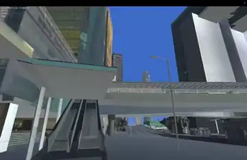
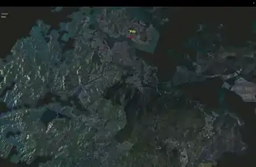
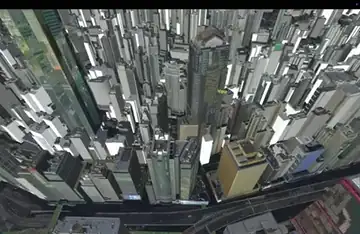
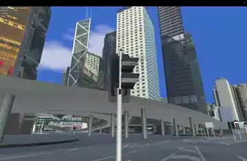
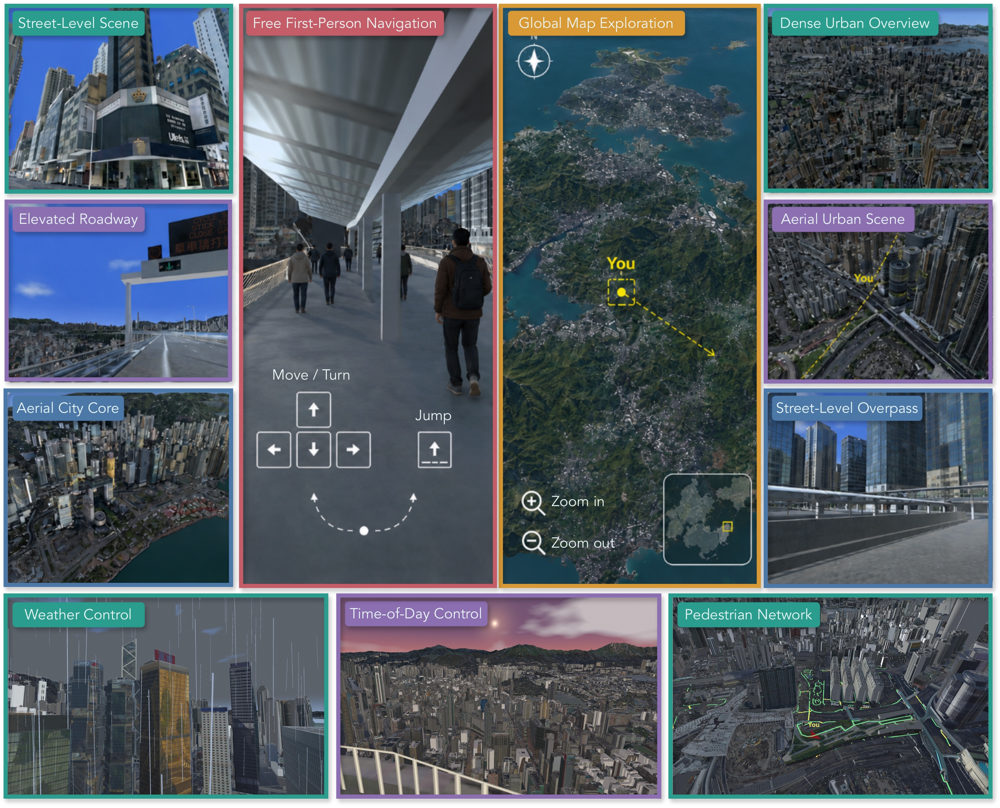
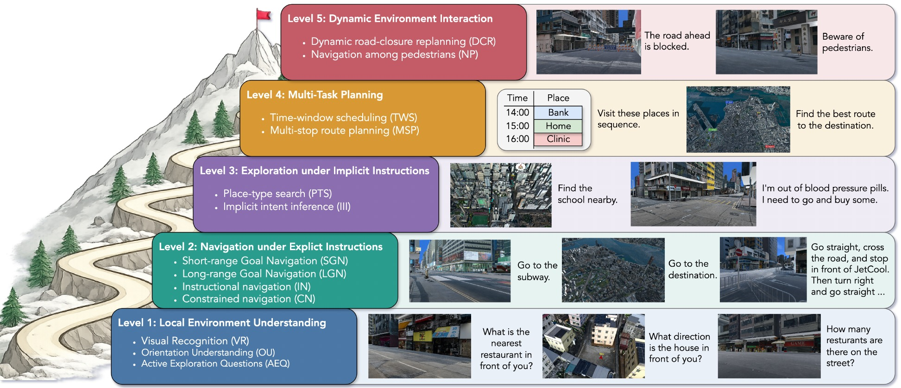
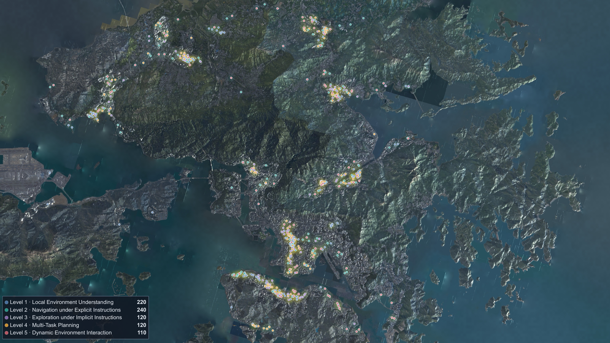
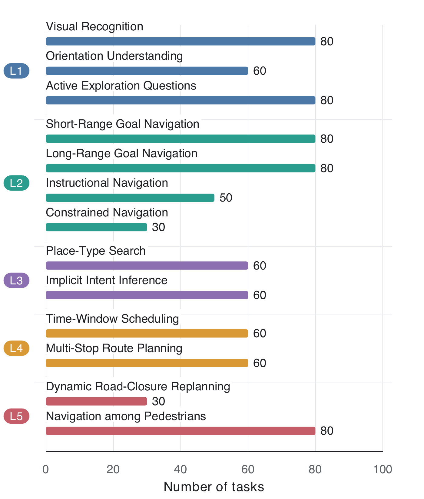

<p align="center">
  
</p>

<p align="center">
  <a href="https://urbanground.github.io"><strong>프로젝트 페이지</strong></a>
  &nbsp;&nbsp;&middot;&nbsp;&nbsp;
  <a href="#애플리케이션-다운로드"><strong>앱 다운로드</strong></a>
  &nbsp;&nbsp;&middot;&nbsp;&nbsp;
  <a href="#인용"><strong>논문 및 인용</strong></a>
  &nbsp;&nbsp;&middot;&nbsp;&nbsp;
  <a href="../../LICENSE"><strong>MIT 라이선스</strong></a>
</p>

<p align="center">
  <a href="../../README.md">English</a> &middot;
  <a href="README_zh.md">简体中文</a> &middot;
  <a href="README_fr.md">Français</a> &middot;
  <a href="README_zh-Hant.md">繁體中文</a> &middot;
  <a href="README_ja.md">日本語</a> &middot;
  <strong>한국어</strong> &middot;
  <a href="README_ar.md">العربية</a> &middot;
  <a href="README_ru.md">Русский</a>
</p>

<table>
  <tr>
    <td width="33.33%" align="center"></td>
    <td width="33.33%" align="center"></td>
    <td width="33.33%" align="center"></td>
  </tr>
  <tr>
    <td align="center"><strong>계단 이동</strong></td>
    <td align="center"><strong>거리 수준 탐색</strong></td>
    <td align="center"><strong>지도 보기 제어</strong></td>
  </tr>
  <tr>
    <td width="33.33%" align="center"></td>
    <td width="33.33%" align="center"></td>
    <td width="33.33%" align="center"></td>
  </tr>
  <tr>
    <td align="center"><strong>장소 검색</strong></td>
    <td align="center"><strong>지도 순간 이동</strong></td>
    <td align="center"><strong>보행자 내비게이션</strong></td>
  </tr>
  <tr>
    <td width="33.33%" align="center"></td>
    <td width="33.33%" align="center"></td>
    <td width="33.33%" align="center"></td>
  </tr>
  <tr>
    <td align="center"><strong>날씨 제어</strong></td>
    <td align="center"><strong>시간대 제어</strong></td>
    <td align="center"><strong>에이전트 통합</strong></td>
  </tr>
</table>

UrbanGround는 멀티모달 대규모 언어 모델(MLLM) 에이전트의 폐루프 평가를 위한 실제 축척 도시
샌드박스입니다. 홍콩 전역의 3D 지리공간 데이터를 연속적으로 렌더링되며 물리적 상호작용이 가능한
Unity 환경으로 변환합니다. 에이전트는 1인칭 카메라를 통해 도시를 관찰하고, 간결한 제어 인터페이스를
통해 행동하며, 환경 안에서 실행한 궤적을 바탕으로 평가받습니다.

함께 제공되는 실험 과제는 국소 장면 이해에서 시작해 명시적 내비게이션, 암묵적 목적지 추론, 다중 경유지
계획, 환경 변화 후의 재계획으로 점차 발전합니다. 모든 원본 과제를 배포된 애플리케이션에서 수동으로
실행하고 검증했습니다.

## 애플리케이션 다운로드

[프로젝트 페이지](https://urbanground.github.io/#play-online)에서는 바로 사용할 수 있는 브라우저 버전을
제공합니다. 키보드와 마우스로 1인칭 시점에서 탐색하거나, OpenAI 호환 엔드포인트, API 키, 모델 이름,
지시문을 입력하여 MLLM이 제어하도록 할 수 있습니다. 키는 현재 브라우저 세션에만 유지되며 UrbanGround에
기록되지 않습니다.

데스크톱 애플리케이션 바이너리와 과제 JSON 파일은 Git 저장소에 보관하지 않고 GitHub Release
아카이브로 함께 배포합니다. 데스크톱 패키지는 Mono 빌드가 아니라 개발용이 아닌 최적화된 Unity IL2CPP
빌드를 사용합니다. 아래 다운로드 링크는 해당 릴리스 자산이 게시되면 사용할 수 있습니다.

| 플랫폼 | 애플리케이션 | 설치 |
| --- | --- | --- |
| Web | [브라우저에서 UrbanGround 실행](https://urbanground.github.io/#play-online) | 설치 불필요 |
| macOS | [UrbanGround-macOS.zip](https://github.com/UrbanGround/UrbanGround/releases/download/v1.0.0/UrbanGround-macOS.zip) | [`Builds/macOS`](../../Builds/macOS/README.md) |
| Windows | [UrbanGround-Windows.zip](https://github.com/UrbanGround/UrbanGround/releases/download/v1.0.0/UrbanGround-Windows.zip) | [`Builds/Windows`](../../Builds/Windows/README.md) |
| Linux | [UrbanGround-Linux.tar.gz](https://github.com/UrbanGround/UrbanGround/releases/download/v1.0.0/UrbanGround-Linux.tar.gz) | [`Builds/Linux`](../../Builds/Linux/README.md) |

운영 체제에 맞는 아카이브를 다운로드하여 해당 로컬 위치에 압축을 푸십시오. 각 패키지에서는
`sandbox.cfg`와 배포된 `task` 디렉터리가 애플리케이션과 같은 위치에 있습니다.

```text
Builds/<platform>/
├── <UrbanGround application>
├── sandbox.cfg
└── task/
    └── <task-id>.json
```

평가 프로그램은 선택된 패키지의 `<build-folder>/task` 디렉터리에서만 과제를 찾습니다. 저장소 수준의
과제 경로는 사용하지 않습니다. 따라서 애플리케이션 패키지를 변경하면 해당 소프트웨어 버전과 함께
배포된 과제 세트도 선택됩니다.

## 시스템 개요

UrbanGround는 홍콩 전역의 3D 지리공간 데이터로 구축된 실제 축척 도시 샌드박스입니다. 동일한
인터페이스를 통해 사용자가 직접 1인칭으로 플레이하거나 MLLM 에이전트가 프로그래밍 방식으로 제어할 수
있습니다. 이 샌드박스는 웹과 macOS, Windows, Linux용 네이티브 빌드로 공개됩니다. 또한 멀티모달
에이전트가 실제 도시를 어떻게 인식하고 행동하는지 연구하기 위한 다양한 과제를 포함합니다.

<p align="center">
  
</p>

## 환경

UrbanGround는 세 개의 계층으로 구성됩니다.

- **지리공간 계층.** [홍콩 토지부(Hong Kong Lands Department)](https://data.gov.hk/en-data/dataset/hk-landsd-openmap-3d-visualisation-map-tile-based-models)가
  공개한 3D Visualisation Map을 지리 좌표가 등록된 Cesium 3D Tiles로 스트리밍합니다.
  [3D Pedestrian Network](https://data.gov.hk/en-data/dataset/hk-landsd-openmap-3d-pedestrian-network)는
  동일한 WGS84 좌표계에 정렬되며, 경로 분석을 위한 연결 그래프로 유지됩니다.
- **시뮬레이션 계층.** Unity 장면은 연속적인 1인칭 이동, 건물 및 지형과의 충돌, 제어 가능한 시계,
  비와 안개, 그리고 정합된 보행자 네트워크 위를 움직이는 애니메이션 보행자를 제공합니다.
- **에이전트 계층.** 로컬 HTTP 인터페이스를 통해 RGB 관측, 물리적 행동, 지도 상호작용, 과제 불러오기,
  평가 프로그램 상태를 제공합니다. 에이전트는 연속 공간에 머물며, 보행자 그래프는 이동 제약이 아니라
  분석 용도로 사용됩니다.

*(선택 사항)* 공개 타일 서비스는 대화형 사용에는 편리하지만, 실험에서 위치를 반복적으로 변경하면 홍콩
전역을 스트리밍하는 데 시간이 오래 걸릴 수 있습니다. 반복 또는 대규모 실행에는 다음 구조를 유지하면서
세 개의 공식 3D Tiles 트리를 로컬 HTTP 서버에 미러링하십시오.

```text
http://<host>:<port>/3d-tiles/
├── f2/tileset.json
├── building/tileset.json
└── infrastructure/tileset.json
```

애플리케이션과 같은 위치에 있는 `sandbox.cfg`를 편집하고 `internal_base_url`이 해당 HTTP 루트를
가리키도록 설정합니다.

```ini
[tileset]
internal_base_url = http://192.168.1.20:8899/3d-tiles
probe_timeout_seconds = 2
```

예시 IP 대신 타일을 제공하는 컴퓨터의 주소를 사용하십시오. UrbanGround는 시작 시 미러를 확인하며,
사용할 수 없으면 홍콩 토지부 서비스로 대체합니다. 현재 사용 중인 소스는 `GET /tileset_source`로 확인할 수
있습니다. 타일 데이터를 로컬 네트워크에 두면 반복적인 순간 이동 및 대규모 평가 실행 시 로딩 시간이 크게
단축됩니다.

## 조작 및 API

수동 조작, 지도 상호작용, HTTP 엔드포인트, 행동 스키마, 과제 불러오기, 스크린샷, Python 예제는
[`docs/CONTROLS_AND_API.md`](../CONTROLS_AND_API.md)에 설명되어 있습니다. 데스크톱 애플리케이션은
기본적으로 `http://127.0.0.1:8081`에서 API를 제공합니다.

## 실험 데이터 및 평가

<p align="center">
  
</p>

논문에서는 환경 안에서 에이전트의 행동을 분석하고 검증하기 위해 5단계로 구성된 실험 과제 모음을
사용합니다. 이는 별도의 소프트웨어 구성 요소가 아니라 애플리케이션과 함께 실험 데이터로 공개됩니다.

| 단계 | 역량 | 과제 유형 |
| --- | --- | --- |
| 1 | 국소 환경 이해 | 시각 인식(Visual Recognition, VR), 방향 이해(Orientation Understanding, OU), 능동 탐색 질문(Active Exploration Questions, AEQ) |
| 2 | 명시적 지시에 따른 내비게이션 | 단거리 목표 내비게이션(Short-range Goal Navigation, SGN), 장거리 목표 내비게이션(Long-range Goal Navigation, LGN), 지시 기반 내비게이션(Instructional Navigation, IN), 제약 조건 내비게이션(Constrained Navigation, CN) |
| 3 | 암묵적 지시에 따른 탐색 | 장소 유형 검색(Place-Type Search, PTS), 암묵적 의도 추론(Implicit Intent Inference, III) |
| 4 | 다중 과제 계획 | 시간 창 스케줄링(Time-Window Scheduling, TWS), 다중 경유지 경로 계획(Multi-Stop Route Planning, MSP) |
| 5 | 동적 환경 상호작용 | 동적 도로 폐쇄 재계획(Dynamic Road-Closure Replanning, DCR), 보행자 사이에서의 내비게이션(Navigation among Pedestrians, NP) |

배포된 프로토콜에는 수동으로 검증한 기본 인스턴스 700개가 포함되어 있습니다. 실험 데이터는 홍콩의
다양한 도시 지역에 분포합니다. 지리적 범위와 다섯 단계 각각의 과제 인스턴스 수는 아래에 요약되어
있습니다.

<table>
  <tr>
    <td width="68%" align="center"></td>
    <td width="32%" align="center"></td>
  </tr>
</table>

## 설치

평가 코드에는 Python 3.10 이상이 필요합니다. 에피소드를 실행하기 전에 호스트 운영 체제용
애플리케이션 패키지를 다운로드하십시오.

```bash
python3 -m venv .venv
source .venv/bin/activate          # Windows: .venv\Scripts\activate
python -m pip install -r requirements.txt
```

OpenAI 호환 멀티모달 모델 엔드포인트를 설정합니다. `AGENT_API_BASE`를 생략하면 기본적으로 OpenAI
API가 사용됩니다.

```bash
export AGENT_API_KEY="..."
export AGENT_MODEL="gpt-4.1"
# export AGENT_API_BASE="https://api.openai.com/v1"
```

공개 서비스에서 타일을 처음 불러오는 데는 선택한 지역과 연결 상태에 따라 몇 분이 걸릴 수 있습니다.
실험을 반복할 때는 [환경](#환경)에서 설명한 로컬 미러를 사용하는 것이 좋습니다.

## 평가 실행

ID로 과제 하나를 실행합니다.

```bash
python AgentEvaluation/run_task.py LQ-20260713-151300 \
  --model "$AGENT_MODEL" \
  --max-steps 100
```

평가 프로그램은 호스트 운영 체제에 따라 `Builds/macOS`, `Builds/Windows`, `Builds/Linux` 중 하나를
자동으로 선택합니다. 별도로 압축을 푼 패키지는 `--build-folder`로 선택할 수 있습니다.

glob을 사용해 과제 계열을 선택합니다.

```bash
python AgentEvaluation/run_task.py --task-glob 'SN-*.json' \
  --model "$AGENT_MODEL" \
  --max-steps 100
```

생성된 조건 변형을 포함하여 전체 실험 프로토콜을 실행합니다.

```bash
python AgentEvaluation/run_task.py --all \
  --model "$AGENT_MODEL" \
  --max-steps 100
```

UrbanGround는 포트 `8081`의 로컬 행동 서버를 사용하므로, 배포된 실행기는 한 번에 하나의 애플리케이션
인스턴스만 평가합니다. 이미 실행 중인 애플리케이션을 사용하려면 `--attach`를 추가하십시오.
성공적으로 완료된 실행의 보고서는 후속 실행에서 재사용됩니다. 이를 교체하려면 `--force-rerun`을 추가하십시오.

평가 결과물은 다음 위치에 기록됩니다.

```text
AgentEvaluation/output/tasks/<model>/<task-id>/
```

각 과제 디렉터리에는 `report.json` 또는 `run_failure.json`이 들어 있으며, 활성화한 경우 에피소드 영상과
원본 프레임도 포함됩니다. 일괄 처리 요약은 `batch_report.json`에 기록됩니다.

## 채점 및 결과 확인

모델 하나의 결과를 요약합니다.

```bash
python AgentEvaluation/score_model.py --model "$AGENT_MODEL"
```

완료된 모델 디렉터리를 비교합니다.

```bash
python AgentEvaluation/compare_models.py
```

읽기 전용 결과 뷰어에서 궤적, 프레임, 영상, 과제별 지표를 살펴봅니다.

```bash
python AgentEvaluation/visualization_site/server.py --port 8000
```

그런 다음 `http://localhost:8000`을 엽니다.

## 향후 계획

- [ ] 다중 에이전트 상호작용
- [ ] 흐리거나 불완전한 장면 지오메트리 복원
- [ ] 더 다양한 차량과 보행자
- [ ] 일부 실내 환경

## 데이터 및 서드파티 구성 요소

UrbanGround는 홍콩 특별행정구 정부가 공개한
[3D Visualisation Map](https://data.gov.hk/en-data/dataset/hk-landsd-openmap-3d-visualisation-map-tile-based-models)과
[3D Pedestrian Network](https://data.gov.hk/en-data/dataset/hk-landsd-openmap-3d-pedestrian-network)를
사용합니다. 이 데이터 세트는 저장소에서 재배포되지 않으며 원래 이용 약관이 계속 적용됩니다.
애플리케이션 패키지에는 Unity 런타임 구성 요소, Cesium for Unity, Microsoft Rocketbox 아바타도
포함되어 있으며, 각각 원 제공자의 라이선스가 적용됩니다.

## 인용

```bibtex
@article{ju2026urbanground,
  title   = {UrbanGround: From Local Perception to Spatial Agency in a Real-Scale City},
  author  = {Ju, Tianjie and Wu, Zheng and Sun, Yueqing and Cui, Yuhan and Li, Bobo and
             Wu, Shengqiong and Cheng, Pengzhou and Zhao, Haodong and Wu, Zongru and
             Ma, Xinbei and Zhang, Doris and Li, Kunling and Lee, Mong-Li and Hsu, Wynne and
             Fei, Hao and Gu, Qi and Liu, Gongshen and Zhang, Zhuosheng},
  year    = {2026}
}
```

## 라이선스

이 프로젝트는 [MIT 라이선스](../../LICENSE)에 따라 배포됩니다.
